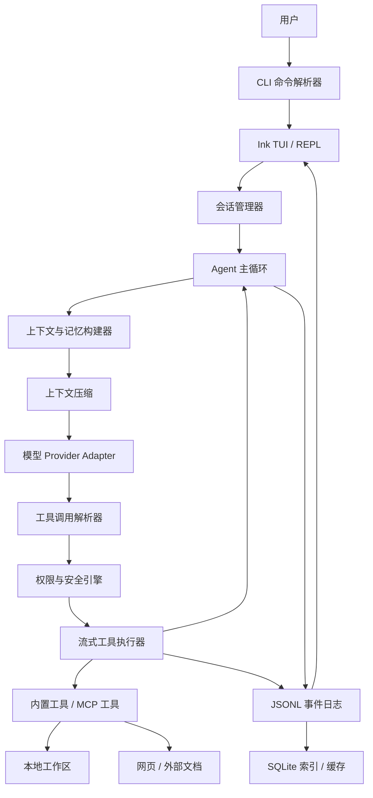
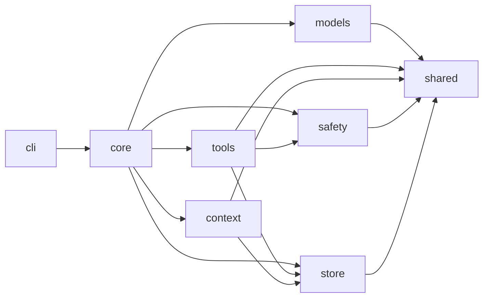
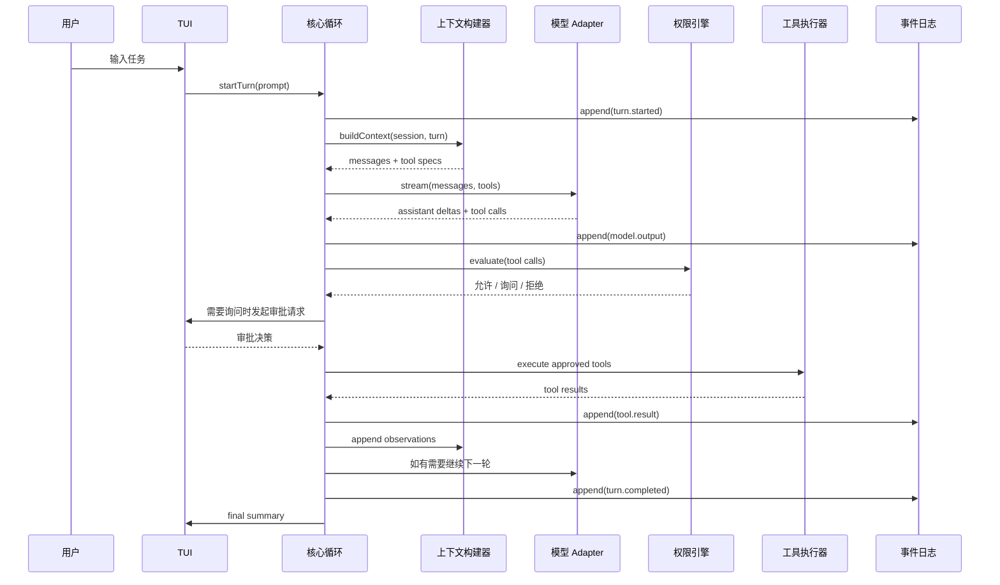
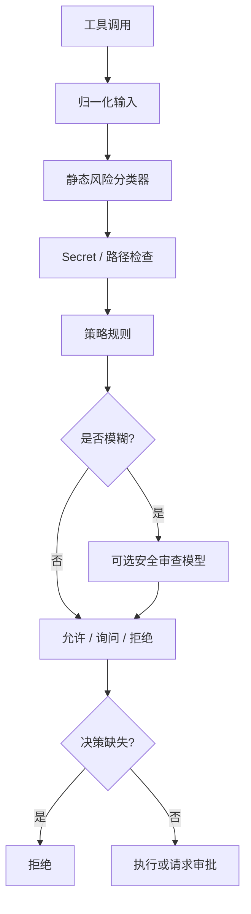
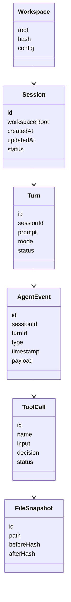

# DreamCode 架构设计文档

版本: v0.1  
日期: 2026-07-08  
状态: 技术栈和总体架构决策  
关联文档: [DreamCode PRD](../prd/dreamcode-prd.md), [DreamCode Agent 产品深度调研](../research/dreamcode-agent-product-research.md)

## 1. 技术栈决策

### 1.1 总体结论

DreamCode v0.1 采用:

> TypeScript 优先 + Node.js 22 LTS + pnpm workspace + Ink TUI + 自研 Agent 运行时。

### 1.2 技术栈表

| 层级 | 选择 | 说明 |
| --- | --- | --- |
| 语言 | TypeScript strict | 学习和迭代速度快, 与 Claude Code/OpenCode 的 TS 生态接近 |
| 运行时 | Node.js 22 LTS | Windows/macOS/Linux 兼容稳, `node-pty`、Ink、官方 SDK 支持成熟 |
| 包管理 | pnpm workspace | 适合 monorepo, 依赖隔离清晰 |
| CLI | `commander` 或 `cac` | 负责参数解析、子命令、模式切换 |
| TUI | React + Ink | 贴近 Claude Code 风格, 适合 REPL、状态面板、diff/approval UI |
| Agent 运行时 | 自研 AsyncGenerator 事件循环 | 学习主循环、工具流、上下文压缩和权限控制 |
| 模型 SDK | OpenAI SDK + 自研 OpenAI-compatible provider adapter | 不直接绑定单一模型, 优先通过 provider preset 支持国产模型厂商 |
| Schema | Zod | 工具参数、配置、事件、模型输出统一校验 |
| 工具系统 | 自研工具注册表 | 每个工具有 schema、风险标签、权限元数据 |
| MCP | `@modelcontextprotocol/sdk` | 作为 P1 扩展入口, 架构预留 |
| 文件搜索 | `ripgrep` 子进程 + JS fallback | 真实项目搜索性能优先 |
| 文件 glob | `fast-glob` | 跨平台文件发现 |
| Shell 执行 | `child_process.spawn` / `execa`; 后续 `node-pty` | MVP 先做非交互命令, 后续支持交互终端 |
| Patch/diff | 自研 patch wrapper + `diff` 包 | 保留变更记录和回滚能力 |
| 配置 | TOML + Markdown | `config.toml` 管配置, `DREAMCODE.md` 管项目规则 |
| 持久化 | JSONL event log + 可选 SQLite index | JSONL 是事实源, SQLite 用于检索和列表 |
| SQLite | Drizzle ORM + `better-sqlite3` 或后续替代 | 只做索引和缓存, 不做核心事实源 |
| 日志 | Pino + event log | 工程日志和 agent 事件分离 |
| 网页抓取 | `undici` + Readability | 网页读取和正文提取 |
| 网页搜索 | 可插拔 provider | Brave/Tavily/模型内置网页搜索均可接入 |
| 测试 | Vitest | 单测、集成测试、工具安全测试 |
| Lint/format | Biome + TypeScript compiler | 速度快, 配置简单 |
| 打包 | tsup | 输出 CLI 可执行 JS 包 |

## 2. 总体架构

### 2.1 分层图



### 2.2 六大核心层

DreamCode 从上到下分为六层:

1. CLI/TUI 层  
   接收用户输入, 展示 agent 状态, 处理审批、中断、恢复和交互。

2. Agent 主循环层  
   实现 `model -> tool calls -> tool results -> continue` 的 while-loop。

3. 工具系统层  
   统一管理文件、搜索、shell、git、web、todo、question、MCP 等工具。

4. Workspace / Memory / Context 层  
   管理项目规则、会话记忆、文件上下文、工具结果和上下文选择。

5. 上下文压缩层  
   在 token 预算不足时对历史消息、工具结果和文件内容进行分级压缩。

6. 权限和安全层  
   为每个工具调用做 allow / ask / deny 判定, 支撑 Safe YOLO。

横切层:

- 事件日志 / 持久化: 所有重要事件追加写入 JSONL。
- 可观测性: 成本、token、步骤、工具耗时、失败原因。
- 配置: 全局配置、workspace 配置、命令行参数。

## 3. 代码组织

### 3.1 单仓结构

建议目录:

```text
DreamCode/
  package.json
  pnpm-workspace.yaml
  tsconfig.json
  biome.json
  docs/
    prd/
    research/
    guides/
    architecture/
  packages/
    cli/
      src/
        main.ts
        commands/
        tui/
        screens/
    core/
      src/
        agent/
        session/
        events/
        config/
        runtime/
    models/
      src/
        providers/
        router/
        token-budget/
    tools/
      src/
        registry/
        builtin/
        mcp/
        shell/
        file/
        git/
        web/
    context/
      src/
        builder/
        memory/
        compression/
        workspace-index/
    safety/
      src/
        permissions/
        classifiers/
        secrets/
        sandbox/
    store/
      src/
        event-log/
        sqlite/
        cache/
    shared/
      src/
        types/
        schemas/
        errors/
        utils/
```

### 3.2 包职责

| 包 | 职责 |
| --- | --- |
| `packages/cli` | CLI 参数、TUI、REPL、用户交互、审批 UI |
| `packages/core` | Agent 主循环、session/turn、事件总线、运行时编排 |
| `packages/models` | 模型 provider preset、OpenAI-compatible 客户端、流式输出、工具调用归一化、成本统计 |
| `packages/tools` | 工具注册表、内置工具、MCP adapter、工具执行 |
| `packages/context` | 工作区索引、记忆、上下文选择、压缩 |
| `packages/safety` | 权限引擎、风险分类、secret 检测、Safe YOLO 规则 |
| `packages/store` | JSONL 事件日志、SQLite 索引、缓存、快照 |
| `packages/shared` | 通用类型、Zod schema、错误类型、路径工具 |

### 3.3 依赖方向

依赖必须单向:



规则:

- `shared` 不依赖任何业务包。
- `core` 编排其他包, 但不实现具体工具细节。
- `tools` 调用 `safety` 做权限判断, 但最终决策入口由 `core` 统一控制。
- `cli` 只消费事件, 不直接操作 workspace。
- `models` 不知道文件系统和工具实现。

## 4. Agent 主循环设计

### 4.1 主循环目标

Agent 主循环要复现 Claude Code / Codex / OpenCode 的核心体验:

- 接收用户目标。
- 构建上下文。
- 调用模型。
- 解析模型输出中的工具调用。
- 执行工具。
- 将工具结果追加回上下文。
- 继续循环直到无工具调用或触发停止条件。

### 4.2 主循环数据流



### 4.3 主循环伪代码

```ts
export async function* runTurn(input: RunTurnInput): AsyncGenerator<AgentEvent> {
  const session = await sessionManager.loadOrCreate(input);
  const turn = await session.startTurn(input.prompt);

  yield event("turn.started", { sessionId: session.id, turnId: turn.id });

  while (true) {
    guardBudget(turn);
    guardLoopHealth(turn);

    const context = await contextBuilder.build({
      session,
      turn,
      mode: input.mode,
      tokenBudget: input.tokenBudget,
    });

    const compacted = await compressionPipeline.fit(context);

    const stream = modelRouter.stream({
      model: input.model,
      messages: compacted.messages,
      tools: toolRegistry.toModelSpecs(input.mode),
    });

    const modelOutput = await collectModelStream(stream, yieldEvent);
    await eventLog.append(modelOutput.events);

    if (modelOutput.toolCalls.length === 0) {
      yield event("turn.completed", { final: modelOutput.text });
      return;
    }

    const decisions = await permissionEngine.evaluateAll(modelOutput.toolCalls, {
      mode: input.mode,
      workspace: session.workspace,
    });

    const approved = await approvalBroker.resolve(decisions, yieldEvent);
    const toolResults = await toolExecutor.executeAll(approved, {
      concurrency: concurrencyFor(approved),
      workspace: session.workspace,
      signal: turn.abortSignal,
    });

    await session.appendToolResults(toolResults);
    yield* toolResults.map((result) => event("tool.result", result));
  }
}
```

### 4.4 停止条件

主循环必须有明确停止条件:

- 模型没有继续请求工具。
- 达到最大工具调用次数。
- 达到最大单轮持续时间。
- 达到最大 token/成本预算。
- 连续 N 次工具失败。
- 连续 N 次重复相同工具调用。
- 用户中断。
- 权限引擎对关键动作硬拒绝。
- 上下文压缩无法继续压缩。

默认建议:

- 单 turn 最大工具调用: 80。
- 单 turn 最大连续失败: 5。
- 单 turn 最大运行时长: 30 分钟。
- 同一工具同一参数重复上限: 3。

这些数字后续通过真实任务调优。

### 4.5 工具并发策略

不是所有工具都能并发。

| 工具类型 | 并发策略 |
| --- | --- |
| read/search/web fetch | 可并发, 默认最多 8 |
| write/patch/delete | 串行 |
| shell command | 默认串行, 只读命令可允许低并发 |
| git write | 串行 |
| question/approval | 阻塞 |
| MCP tool | 根据 tool metadata 决定 |

原则:

- 读可以并发。
- 写必须可审计。
- 影响同一文件的操作必须串行。
- shell 默认保守。

## 5. 模型层设计

### 5.1 Provider 适配器层

DreamCode 不直接把核心逻辑绑死在某一家模型 API 上。

统一接口:

```ts
export interface ModelProvider {
  name: string;
  stream(input: ModelStreamInput): AsyncIterable<ModelEvent>;
  countTokens?(input: TokenCountInput): Promise<TokenUsageEstimate>;
}
```

第一阶段支持:

- `fake` provider, 用于确定性测试。
- `openai` preset, 用于 OpenAI 官方 API。
- `deepseek` preset, 用于 DeepSeek。
- `qwen` preset, 用于阿里云百炼 / Qwen。
- `kimi` preset, 用于 Kimi / Moonshot。
- `zhipu` preset, 用于智谱 / Z.AI。
- `siliconflow` preset, 用于硅基流动。
- `minimax` preset, 用于 MiniMax。
- `openai-compatible` preset, 用于自定义兼容厂商。

后续支持:

- Anthropic-compatible 协议适配。
- Responses API 适配。
- 多模型 router 和 fallback。
- 本地模型 provider。

### 5.2 模型路由器

Model Router 负责:

- 根据配置选择模型。
- 根据任务模式选择模型。
- 根据工具调用能力选择模型。
- 根据上下文长度选择模型。
- 收集 token/cost usage。

建议配置:

```toml
[models]
default = "deepseek:deepseek-v4-pro"
fast = "qwen:qwen3.7-plus"
safe_reviewer = "openai:gpt-5.4-mini"

[models.limits]
max_turn_cost_usd = 1.00
max_context_tokens = 128000
```

模型名以实际可用模型为准, 配置中不硬编码在核心代码里。

第一阶段 CLI 已支持:

- `--provider`
- `--model`
- `--api-key`
- `--api-key-env`
- `--base-url`
- `--list-providers`

配置优先级为: CLI 参数 > provider 专属环境变量 > `DREAMCODE_*` 通用环境变量 > preset 默认值。

### 5.3 工具调用归一化器

不同模型返回工具调用的格式不同。DreamCode 内部统一为:

```ts
export interface NormalizedToolCall {
  id: string;
  name: string;
  input: unknown;
  rawProvider: string;
  raw: unknown;
}
```

模型层只负责:

- 流式事件归一化。
- 文本增量。
- provider 暴露 reasoning/hidden metadata 时记录相关 metadata。
- 工具调用开始/增量/结束。
- 用量/成本。

模型层不执行工具, 也不做权限判断。

## 6. 工具系统设计

### 6.1 工具接口

```ts
export interface Tool<TInput, TOutput> {
  name: string;
  description: string;
  inputSchema: z.ZodType<TInput>;
  outputSchema: z.ZodType<TOutput>;
  risk: ToolRiskProfile;
  timeoutMs: number;
  execute(input: TInput, context: ToolExecutionContext): Promise<ToolResult<TOutput>>;
}
```

工具必须声明:

- 输入 schema。
- 输出 schema。
- 风险等级。
- 是否读写文件。
- 是否可能产生外部副作用。
- 是否支持回滚。
- 默认 timeout。
- 输出截断策略。

### 6.2 工具注册表

Tool Registry 负责:

- 注册内置工具。
- 注册 MCP 工具。
- 按运行模式过滤工具。
- 输出模型可见 tool specs。
- 根据 tool name 分发执行。

工具注册示例:

```ts
registry.register(readFileTool);
registry.register(applyPatchTool);
registry.register(bashTool);
registry.register(grepTool);
registry.register(todoWriteTool);
registry.register(questionTool);
```

### 6.3 内置工具列表

MVP 必备:

| 工具 | 功能 | 默认权限 |
| --- | --- | --- |
| `file.read` | 读取 workspace 内文件 | allow |
| `file.write` | 创建/覆盖文件 | yolo allow, guided ask |
| `file.patch` | 应用 patch | yolo allow, guided ask |
| `file.list` | 列目录 | allow |
| `search.grep` | 内容搜索 | allow |
| `search.glob` | 路径搜索 | allow |
| `shell.run` | 执行命令 | 按风险分类 |
| `git.status` | 查看 git 状态 | allow |
| `git.diff` | 查看 diff | allow |
| `web.fetch` | 抓取网页 | allow/ask by config |
| `web.search` | 搜索网页 | allow/ask by config |
| `todo.write` | 更新计划 | allow |
| `question.ask` | 向用户提问 | allow |

P1:

- `git.stage`。
- `git.commit`。
- `mcp.call`。
- `skill.load`。
- `agent.run`。
- `lsp.diagnostics`。
- `lsp.references`。
- `browser.inspect`。

### 6.4 工具结果

工具结果必须结构化:

```ts
export interface ToolResult<T = unknown> {
  toolCallId: string;
  status: "success" | "error" | "cancelled" | "denied";
  data?: T;
  summary: string;
  stdoutRef?: string;
  stderrRef?: string;
  artifactRefs?: string[];
  changedFiles?: ChangedFile[];
  error?: ToolError;
  usage?: ToolUsage;
}
```

原则:

- 模型看到 summary 和必要结构化数据。
- 完整 stdout/stderr 落盘, 用 ref 引用。
- 大输出不直接进入上下文。
- 文件变更必须记录 changedFiles。

## 7. 工作区和文件系统设计

### 7.1 工作区边界

工作区是 DreamCode 的安全边界。

规则:

- 默认工作区 = `process.cwd()`。
- 所有路径先解析成绝对路径。
- 所有文件读写必须确认在工作区内。
- 符号链接必须解析后再次检查。
- 工作区外读取默认拒绝, 可配置为询问。
- 工作区外写入默认拒绝。

### 7.2 项目规则

DreamCode 支持:

```text
<workspace>/DREAMCODE.md
<workspace>/.dreamcode/config.toml
<workspace>/.dreamcodeignore
```

`DREAMCODE.md` 用于软上下文:

- 项目介绍。
- 常用命令。
- 编码规范。
- 测试要求。
- 用户偏好。

`.dreamcode/config.toml` 用于硬配置:

- 默认模式。
- 权限规则。
- 模型配置。
- 忽略路径。
- 最大预算。

### 7.3 文件快照和回滚

每次写文件前:

1. 读取原文件内容。
2. 计算快照 hash。
3. 保存快照到全局 DreamCode 状态。
4. 执行写入。
5. 计算 diff。
6. 追加 event。

不要默认把快照存在工作区中, 避免污染用户项目。

建议路径:

```text
~/.dreamcode/
  sessions/
    <session-id>/
      events.jsonl
      outputs/
      snapshots/
      patches/
```

Windows 对应:

```text
%USERPROFILE%\.dreamcode\
```

## 8. 记忆和上下文设计

### 8.1 记忆分层

DreamCode 初期不做复杂向量数据库, 采用 Agentic Search:

1. 常驻索引  
   工作区根目录、项目类型、关键配置、DREAMCODE.md 摘要、最近任务摘要。

2. 话题按需加载  
   根据当前任务搜索相关文件、历史事件、命令结果、文档片段。

3. 历史搜索  
   通过 JSONL 事件日志和 SQLite 索引查找过往任务。

这与“先复现核心 agent 行为”的目标一致, 不过早引入 RAG 系统。

### 8.2 上下文构建器

上下文构建器输入:

- system prompt。
- developer prompt。
- 当前用户任务。
- 运行模式。
- 工作区摘要。
- 项目规则。
- 最近消息。
- todo 状态。
- 已读文件摘要。
- 相关文件片段。
- 工具结果摘要。
- 安全约束。

输出:

- 模型消息。
- 可用工具规格。
- token 预算报告。
- 被省略内容引用。

### 8.3 上下文来源优先级

建议优先级:

1. 系统安全规则。
2. 当前用户明确指令。
3. 当前 turn 上下文。
4. 工作区 `DREAMCODE.md`。
5. 工作区配置。
6. 近期工具结果。
7. 历史 session 摘要。
8. 自动生成记忆。

冲突时:

- 安全规则最高。
- 当前用户指令高于历史记忆。
- 硬配置高于软上下文。

## 9. 上下文压缩设计

### 9.1 目标

上下文压缩不是简单截断, 而是让 agent 在长任务中保持连续性。

需要保留:

- 用户目标。
- 已确认约束。
- 当前计划。
- 已完成步骤。
- 已修改文件。
- 验证结果。
- 未解决问题。
- 关键工具结果。
- 风险和阻塞。

### 9.2 五级压缩管线

参考用户提供的 Claude Code 架构图, DreamCode 使用五级压缩:

1. Snip  
   删除明显无用或重复的低价值内容, 如超长日志、重复进度、无关 stdout。

2. Micro  
   把长工具结果压成短摘要, 保留 ref 指向完整输出。

3. Collapse  
   把较早的多轮消息和工具结果折叠成结构化摘要。

4. Auto  
   当 token 预算超过阈值时自动触发压缩。

5. Reactive  
   当模型返回上下文过长、循环质量下降、或长任务阶段切换时主动重建上下文。

### 9.3 九段式结构摘要

压缩输出统一成九段:

1. 目标: 用户目标。
2. 约束: 用户约束和安全限制。
3. 工作区: 项目结构和关键文件。
4. 计划: 当前计划和 todo。
5. 已完成: 已完成动作。
6. 变更: 文件变更和产物。
7. 证据: 测试、命令、来源链接。
8. 待解决问题: 剩余问题和失败尝试。
9. 下一步: 下一步建议。

### 9.4 压缩触发阈值

建议:

- 使用上下文预算 70%: 开始 Micro。
- 使用上下文预算 85%: 开始 Collapse。
- 使用上下文预算 95%: 强制 Reactive。
- 工具输出超过 20KB: 自动落盘并摘要。
- 单个文件超过 30KB: 按行范围读取或摘要。

阈值后续根据真实模型上下文和成本调整。

## 10. 权限和安全设计

### 10.1 核心原则

DreamCode 的 Safe YOLO 不是无限权限, 而是:

> workspace 内低风险操作自动执行, workspace 外、高危命令、secret、外部副作用默认拦截。

### 10.2 权限决策流程



### 10.3 风险分类

风险标签:

- `read_workspace`。
- `write_workspace`。
- `read_external_path`。
- `write_external_path`。
- `secret_access`。
- `delete_file`。
- `bulk_delete`。
- `shell_readonly`。
- `shell_mutating`。
- `network_access`。
- `external_side_effect`。
- `git_history_rewrite`。
- `long_running`。
- `costly`。

### 10.4 权限决策

```ts
export interface PermissionDecision {
  decision: "allow" | "ask" | "deny";
  reason: string;
  risk: RiskTag[];
  reviewer: "rules" | "safety-model" | "user";
  canRemember?: boolean;
}
```

### 10.5 Safe YOLO 默认规则

允许:

- workspace 内普通文件读。
- workspace 内普通文件写。
- workspace 内 patch。
- `git status`、`git diff`、`git log`。
- 常见测试命令。
- 常见 lint/typecheck/build 命令。
- grep/glob。
- todo/question。

询问:

- 删除文件。
- 大量文件修改。
- 安装依赖。
- 创建 git commit。
- 访问网络。
- 运行未知 shell 命令。
- workspace 外读取。

拒绝:

- workspace 外写入。
- 读取 secret 文件。
- 删除大量文件且无明确用户要求。
- `rm -rf /` 等危险命令。
- force push。
- 修改系统权限。
- 部署生产环境。
- 发送外部消息。
- 支付或购买。

### 10.6 影子安全模型

为了学习 Claude Code 风格的“主 AI 干活 + 审查器兜底”, DreamCode 设计一个可选 Safety Reviewer。

使用场景:

- shell 命令风险不明确。
- 工具描述和参数复杂。
- 用户开启更自动化的 Safe YOLO。
- 静态规则无法判断。

要求:

- Safety Reviewer 只输出结构化 JSON。
- 不能 override hard deny。
- 出错时 fail-closed。
- 可配置关闭以节省成本。

### 10.7 Secret 保护

Secret 检测来源:

- 文件名规则: `.env`, `.pem`, `.key`, `id_rsa`, `credentials`, `token`。
- 内容规则: API key/token/secret regex。
- git ignored 文件。

处理:

- 默认 deny read。
- 工具输出脱敏。
- event log 中脱敏。
- prompt 中脱敏。

## 11. 会话和事件日志设计

### 11.1 领域模型



### 11.2 事件类型

核心事件:

- `session.created`
- `turn.started`
- `user.message`
- `context.built`
- `context.compressed`
- `model.stream.started`
- `model.delta`
- `model.tool_call`
- `permission.requested`
- `permission.decided`
- `tool.started`
- `tool.output`
- `tool.completed`
- `file.snapshot`
- `file.changed`
- `todo.updated`
- `turn.interrupted`
- `turn.completed`
- `turn.failed`

### 11.3 JSONL 作为事实源

每个 session 一个 `events.jsonl`:

```jsonl
{"id":"evt_1","type":"turn.started","timestamp":"...","payload":{"turnId":"turn_1"}}
{"id":"evt_2","type":"tool.started","timestamp":"...","payload":{"tool":"search.grep"}}
{"id":"evt_3","type":"tool.completed","timestamp":"...","payload":{"status":"success"}}
```

选择 JSONL 的原因:

- 追加写简单可靠。
- 崩溃后容易恢复。
- 方便人工检查。
- 适合 replay。
- 不依赖数据库即可启动。

SQLite 只做:

- session 列表。
- 搜索索引。
- 文件摘要缓存。
- 成本统计。

### 11.4 恢复

恢复任务时:

1. 读取 session events。
2. 重建 turn 状态。
3. 重建 todo。
4. 重建已修改文件列表。
5. 读取最近 context summary。
6. 向模型说明这是恢复任务。

## 12. CLI/TUI 设计

### 12.1 CLI 命令

```bash
dreamcode
dreamcode "修复失败测试"
dreamcode --mode plan "分析当前仓库"
dreamcode --mode yolo "实现 TODO"
dreamcode resume
dreamcode sessions
dreamcode config
```

### 12.2 TUI 布局

```text
┌────────────────────────────────────────────────────────────┐
│ DreamCode  session: abc123  mode: safe-yolo  model: ...    │
├───────────────────────────────┬────────────────────────────┤
│ 对话 / 流式输出                 │ 计划 / Todo                │
│                                │ [x] 读取项目               │
│ > 用户输入                      │ [~] 编辑文件               │
│ assistant 流式输出...           │ [ ] 运行测试               │
├───────────────────────────────┼────────────────────────────┤
│ 工具事件                       │ 文件 / Diff / 审批         │
│ search.grep ok                 │ src/foo.ts 已修改          │
│ shell.run npm test failed      │ 审批: 安装依赖?            │
└───────────────────────────────┴────────────────────────────┘
```

### 12.3 REPL 行为

REPL 支持:

- 普通自然语言输入。
- `/mode plan|guided|yolo|full`。
- `/interrupt`。
- `/resume <session>`。
- `/diff`。
- `/approve`。
- `/deny`。
- `/cost`。
- `/compact`。
- `/help`。

### 12.4 Vim 模式

Vim 模式可以作为后续增强, 不进入第一阶段必需项。

## 13. 配置设计

### 13.1 配置位置

全局:

```text
~/.dreamcode/config.toml
```

workspace:

```text
<workspace>/.dreamcode/config.toml
```

规则:

```text
<workspace>/DREAMCODE.md
```

忽略:

```text
<workspace>/.dreamcodeignore
```

### 13.2 配置优先级

命令行参数 > workspace config > global config > 默认值。

### 13.3 配置示例

```toml
mode = "safe-yolo"

[models]
default = "deepseek:deepseek-v4-pro"
fast = "qwen:qwen3.7-plus"
safety = "openai:gpt-5.4-mini"

[workspace]
allow_external_read = false
allow_external_write = false

[limits]
max_tool_calls = 80
max_turn_minutes = 30
max_turn_cost_usd = 1.00

[permissions.shell]
"git status" = "allow"
"git diff*" = "allow"
"npm test*" = "allow"
"rm -rf*" = "deny"
"git push*" = "ask"

[web]
enabled = true
search_provider = "brave"
```

## 14. LSP 和代码智能

LSP 是 coding agent 效果的重要增强, 但不是第一阶段主循环的前置条件。

建议:

- MVP 用 grep/glob/read/测试命令完成核心闭环。
- P1 接入 LSP diagnostics。
- P1 再接入 references/definition/symbols。

原因:

- LSP 跨语言配置复杂。
- 主循环、工具、权限、事件日志更关键。
- OpenCode 的 LSP 设计可作为后续重点参考。

## 15. MCP、技能、钩子、子代理

这些能力用于对齐 Claude Code / Codex / OpenCode, 但分阶段实现。

### 15.1 MCP

架构预留:

- `packages/tools/src/mcp/`。
- MCP tools 统一转为 DreamCode Tool。
- MCP tool metadata 进入 permission engine。

实现优先级: P1。

### 15.2 技能

Skill 采用目录格式:

```text
skills/
  diagnose/
    SKILL.md
    scripts/
    references/
```

加载策略:

- 初始只加载 name/description。
- 模型或用户选中后再读取完整 `SKILL.md`。
- references 按需读取。

实现优先级: P1。

### 15.3 钩子

Hooks 用于确定性事件自动化:

- beforeToolCall。
- afterToolCall。
- beforeFileWrite。
- afterTurnCompleted。

实现优先级: P2。

### 15.4 子代理

Subagent 用于隔离上下文:

- researcher。
- reviewer。
- verifier。
- scout。

实现优先级: P2。第一阶段先用单 agent 完成闭环。

## 16. Web 和调研能力

Web 能力服务于 PRD 中的调研、报告、技术方案场景。

### 16.1 网页搜索

设计为 provider:

```ts
export interface WebSearchProvider {
  search(query: string, options: SearchOptions): Promise<SearchResult[]>;
}
```

可接:

- Brave Search API。
- Tavily。
- 模型内置 web search。
- 用户自定义脚本。

### 16.2 网页抓取

流程:

1. fetch URL。
2. 提取正文。
3. 保存原始 HTML ref。
4. 生成摘要。
5. 返回 title、url、published date、content summary、引用片段。

调研报告必须保存来源链接。

## 17. 测试策略

### 17.1 单元测试

重点:

- path boundary。
- permission rules。
- command risk classifier。
- secret redaction。
- context compression。
- tool schema validation。

### 17.2 集成测试

重点:

- agent loop 使用 fake model。
- 工具调用执行。
- 文件 patch 和回滚。
- JSONL event replay。
- Safe YOLO allow/ask/deny。

### 17.3 真实任务回归集

建立 `evals/tasks/`:

```text
evals/
  tasks/
    fix-failing-test/
    add-small-feature/
    write-research-report/
    update-readme/
```

每个任务包含:

- fixture workspace。
- 用户 prompt。
- 期望文件变化。
- 期望验证命令。
- 成功判定。

这是学习 agent 产品最关键的工程资产之一。
