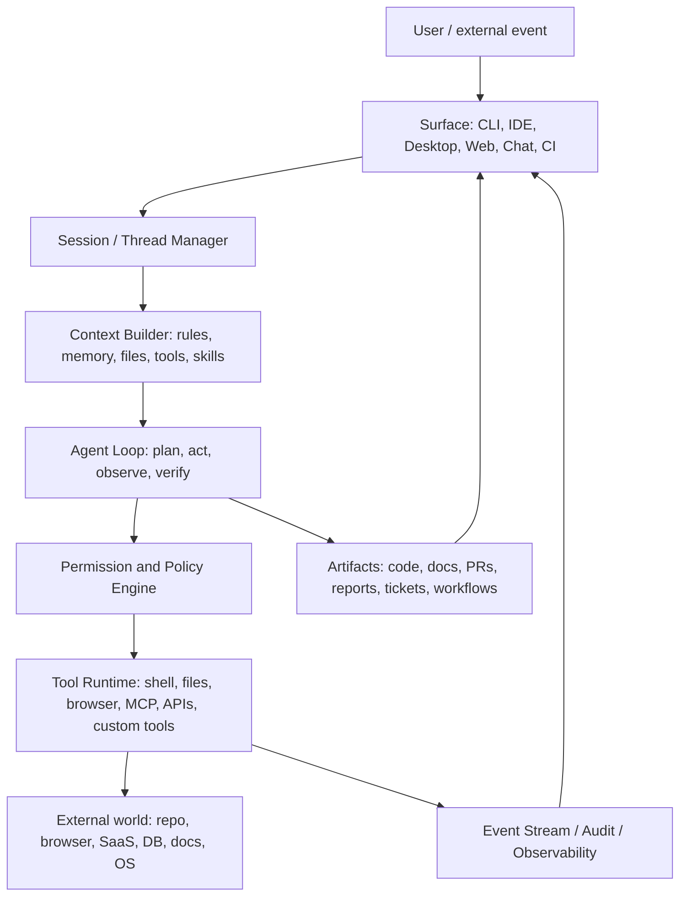
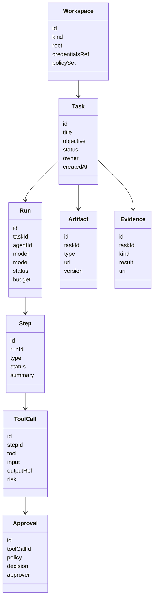

# DreamCode Agent 产品深度调研

调研日期: 2026-07-08  
目标: 借鉴 Claude Code、Codex、OpenCode 的产品设计、Agent 架构、扩展机制和技术选型, 为 DreamCode 后续 PRD 提供输入。

## 1. 执行摘要

DreamCode 不应只被定义为 coding agent。更合理的定位是:

> DreamCode 是一个面向真实用户任务的本地优先、可扩展、可审计的通用任务 Agent Runtime。编码只是第一类任务场景, 不是产品边界。

从 Claude Code、Codex、OpenCode 的公开资料看, 成熟 agent 产品的竞争力不在于单次模型回答, 而在于模型外层的控制平面:

- 会话: 能保存、恢复、分叉、并行执行任务。
- 上下文: 能按项目、用户、组织、任务、文件路径动态加载规则和记忆。
- 工具: 能读写文件、执行命令、浏览网页、调用外部服务, 并通过 MCP 或插件扩展。
- 权限: 能把危险动作变成可审批、可拒绝、可回滚、可审计的事件。
- 执行循环: 能自己探索、行动、验证, 并允许用户随时打断和转向。
- 扩展机制: 技能、命令、子代理、hooks、plugins、MCP servers。
- 多界面: CLI/TUI、IDE、桌面、Web/cloud、CI、Slack/GitHub 等入口复用同一 agent 核心。
- 可观测性: 记录模型请求、工具调用、成本、结果、失败和重放线索。

DreamCode 的机会点在于: 不要把这些能力做成只服务代码库的功能, 而是抽象成“任务操作系统”。代码库、浏览器、文档、表格、邮件、日历、工单、数据库、设计稿、企业知识库都应只是不同 Location 和 Tool Domain。

## 2. 核心结论

### 2.1 三个产品的本质差异

| 产品 | 本质 | 核心优势 | 对 DreamCode 的启发 |
| --- | --- | --- | --- |
| Claude Code | Anthropic 的闭源 agentic coding 产品和 Agent SDK | agent loop、权限模式、hooks、skills、subagents、跨 terminal/IDE/desktop/web/chat 的统一体验 | 学习其“产品完整性”和可控执行 UX |
| Codex | OpenAI 的 coding agent 产品和本地/云端/SDK/app-server 体系 | Rust 本地 runtime、sandbox、app-server JSON-RPC、SDK、MCP、skills、plugins、worktrees、automation | 学习其“工程化 runtime”和可嵌入协议层 |
| OpenCode | 开源 coding agent, TUI/desktop/IDE, 多模型, server/client 架构 | 开源可研究、OpenAPI server、TS/Bun 技术栈、LSP、权限规则、agents 配置 | 学习其“开放架构”和多 provider 策略 |

### 2.2 共同设计模式

这三类产品逐渐收敛到同一个架构范式:



### 2.3 DreamCode 的产品边界建议

DreamCode 应先以 coding agent 为落地场景, 但架构上保持通用任务能力:

- 不把 `workspace` 只理解成代码目录, 而是抽象为 Location: repo、浏览器 profile、文档空间、SaaS workspace、远程 VM、容器。
- 不把 `tool` 只理解成 shell/file, 而是抽象为 Capability: 读、写、搜索、执行、发布、支付、发消息、变更远程状态。
- 不把 `verification` 只理解成测试, 而是抽象为 Evidence: 单元测试、截图对比、网页检查、数据校验、审批回执、外部系统状态。
- 不把 `artifact` 只理解成 diff, 而是抽象为 Deliverable: 代码变更、PR、文档、表格、邮件草稿、报告、网页、工单、自动化任务。

## 3. Claude Code 调研

### 3.1 产品定位

Claude Code 官方定位是 agentic coding tool。它可以读取代码库、编辑文件、运行命令, 并集成开发工具。官方文档还强调它不只做编码, 也能处理命令行可完成的任务, 例如写文档、运行构建、搜索文件、研究主题等。来源: [Claude Code overview](https://code.claude.com/docs/en/overview), [How Claude Code works](https://code.claude.com/docs/en/how-claude-code-works)。

关键能力:

- 在 terminal、IDE、desktop app、browser 中使用。
- 能构建功能、修 bug、写测试、解决 lint、更新依赖、处理 merge conflict、写 release notes。
- 能直接操作 git, 包括 stage、commit、branch、PR。
- 能在 CI 中做 code review 和 issue triage。
- 能通过 MCP 读取 Jira、Slack、Google Drive、数据库等外部系统。
- 支持 schedule、routines、remote control、Slack 等远程/异步入口。

### 3.2 Agent 主循环

Claude Code 将任务执行解释为三个阶段循环:

1. 收集上下文: 搜索文件、阅读代码、获取工具输出。
2. 执行动作: 编辑文件、运行命令、调用外部工具。
3. 验证结果: 运行测试、检查输出、根据失败继续修正。

这个循环不是固定流水线, 而是模型基于新观察不断决策。用户可以中途打断、补充上下文、改变方向。来源: [How Claude Code works](https://code.claude.com/docs/en/how-claude-code-works)。

对 DreamCode 的启发:

- PRD 应把“可中断、可转向”写成核心交互, 不是附加功能。
- Agent loop 应是一等运行时对象, 每一步都能被 UI 展示、审计、暂停、恢复。
- “验证”必须是一等概念。没有验证的 agent 只能算内容生成器。

### 3.3 工具体系

Claude Code 的内置工具大致分为:

- 文件操作: 读文件、编辑、创建、重命名。
- 搜索: 文件模式搜索、regex 内容搜索、代码库探索。
- 执行: shell、测试、git、构建工具。
- Web: 搜索网页、抓取文档、查错误信息。
- Code intelligence: 类型错误、跳转定义、查引用, 需要 code intelligence plugin。
- 编排工具: subagents、提问、其他 agent 调度。

来源: [How Claude Code works](https://code.claude.com/docs/en/how-claude-code-works)。

对 DreamCode 的启发:

- 工具应按“能力类型”建模, 而不是按具体实现建模。
- 工具调用要返回结构化 observation, 不能只是纯文本日志。
- 每个工具都应声明权限等级、是否可回滚、是否影响外部世界、输出是否需要截断和落盘。

### 3.4 上下文与记忆

Claude Code 有两个持久知识机制:

- `CLAUDE.md`: 用户或团队写的项目规则、架构约定、命令、标准。
- Auto memory: Claude 自己基于用户纠正和项目经验保存的学习结果。

官方文档强调这两者是上下文, 不是强制配置。若要强制阻止行为, 应使用 hook。来源: [Claude memory](https://code.claude.com/docs/en/memory)。

CLAUDE.md 的作用范围包括:

- 组织级托管规则。
- 用户级规则。
- 项目级规则。
- 本地个人规则。
- 子目录按需加载规则。

对 DreamCode 的启发:

- 需要区分 Soft Context 和 Hard Policy。
- Soft Context: 模型应该知道的偏好、规则、知识。
- Hard Policy: 系统必须强制执行的权限、合规、安全边界。
- 记忆不应无边界增长, 需要可查看、可编辑、可禁用、可审计。

### 3.5 权限模式

Claude Code 暴露多种 permission mode:

- default/manual: 读操作可直接做, 写文件和命令需审批。
- acceptEdits: 自动接受文件编辑和常见文件系统命令。
- plan: 只读探索和规划, 不修改源码。
- auto: 背景安全检查后自动批准部分动作。
- dontAsk: 只运行预批准工具, 适合 CI。
- bypassPermissions: 全部允许, 仅适合隔离容器或 VM。

来源: [Claude permission modes](https://code.claude.com/docs/en/permission-modes)。

对 DreamCode 的启发:

- 权限不应只是 allow/deny, 还要有交互模式。
- 面向通用任务时, 权限要按风险维度拆分:
  - 本地读写风险。
  - 外部系统写入风险。
  - 金钱/发送/发布/删除风险。
  - 数据外泄风险。
  - 长时间运行和资源消耗风险。
- “Plan mode” 是高价值设计: 它给用户低风险试用入口, 也适合复杂任务先探索再执行。

### 3.6 会话、检查点与恢复

Claude Code 会保存会话, 支持 resume、branch/fork、session picker。官方说明 CLI 会把会话连续保存为本地 transcript 文件。它还在文件编辑前做 snapshot, 允许用户 rewind 文件变化。来源: [Claude sessions](https://code.claude.com/docs/en/sessions), [How Claude Code works](https://code.claude.com/docs/en/how-claude-code-works)。

对 DreamCode 的启发:

- Agent 产品必须把“任务历史”当作产品资产。
- 对可逆动作做 checkpoint, 对不可逆动作做强审批和二次确认。
- Fork 不只是会话功能, 也是探索多个方案和 A/B plan 的基础。
- 长任务必须支持恢复, 不能把执行状态只放在进程内存里。

### 3.7 扩展层: 技能、子代理、钩子、MCP、插件

Claude Code 的扩展层清晰地区分了不同问题:

- `CLAUDE.md`: 每次会话都要知道的持久上下文。
- Skills: 可复用知识、流程、可触发命令。内容按需加载, 降低上下文成本。
- MCP: 连接外部服务和工具。
- Subagents: 独立上下文的专用 worker, 用于并行、隔离、减少主上下文污染。
- Hooks: 生命周期事件上的确定性自动化, 可执行 shell、HTTP request、prompt 或 subagent。
- Plugins: 打包 skills、hooks、subagents、MCP servers 供分发。

来源: [Extend Claude Code](https://code.claude.com/docs/en/features-overview), [Claude skills](https://code.claude.com/docs/en/skills), [Claude subagents](https://code.claude.com/docs/en/sub-agents), [Claude hooks](https://code.claude.com/docs/en/hooks-guide), [Claude MCP](https://code.claude.com/docs/en/mcp)。

对 DreamCode 的启发:

- DreamCode 的扩展能力应有分层命名, 不要把所有东西都叫 plugin。
- Skill 是“知识和流程”。
- Tool/MCP 是“可执行能力和数据连接”。
- Hook 是“确定性生命周期自动化”。
- Subagent 是“隔离上下文和权限的执行者”。
- Plugin 是“分发包”。

### 3.8 Agent SDK

Claude Agent SDK 暴露 Python 和 TypeScript 接口, 让开发者使用与 Claude Code 相同的工具、agent loop 和上下文管理。它可用于构建会读文件、跑命令、搜索 Web、编辑代码的生产 agent。来源: [Claude Agent SDK overview](https://code.claude.com/docs/en/agent-sdk/overview)。

对 DreamCode 的启发:

- SDK 不是锦上添花, 而是生态入口。
- 如果 DreamCode 要成为平台, runtime 必须 API-first。
- UI 只是 runtime 的一个 client。

## 4. Codex 调研

### 4.1 产品定位

Codex 是 OpenAI 的软件开发 coding agent, 可写代码、理解陌生代码库、review、debug、自动化开发任务。来源: [Codex overview](https://developers.openai.com/codex)。

Codex 的产品形态包括:

- CLI。
- IDE extension。
- Codex app desktop。
- Codex web/cloud。
- GitHub Action。
- Slack、Linear 等集成。
- SDK。
- App Server。
- MCP server。

对 DreamCode 的启发:

- 不要把入口和 agent 核心绑死。CLI、Web、IDE、桌面都应是同一 runtime 的不同 client。
- 先设计 thread/turn/item/event 这类内部对象, 再决定 UI。

### 4.2 Codex 应用与多任务体验

Codex app 官方定位是 desktop experience, 支持并行线程、内置 worktree、automations、Git 功能。来源: [Codex app](https://developers.openai.com/codex/app)。

关键设计:

- 多线程并行。
- worktree 隔离并行代码修改。
- review pane 和 Git 操作。
- automations 支持计划任务、监控、周期性工作。
- in-app browser、Chrome extension、Computer Use 扩大可操作环境。

对 DreamCode 的启发:

- DreamCode 桌面端的核心不是聊天窗口, 而是任务控制台。
- 多任务列表、进度、风险审批、产物预览、失败恢复应在第一屏。
- 对通用任务来说, “workspace isolation” 不一定是 git worktree, 也可以是浏览器 profile、临时文档副本、沙箱 VM、测试数据库分支。

### 4.3 应用服务器协议

Codex app-server 是 Codex 用来支撑 rich clients 的接口, 适合需要认证、会话历史、审批和流式 agent events 的深度集成。它通过 JSON-RPC 2.0 风格消息通信, 支持 stdio、WebSocket、Unix socket 等 transport。来源: [Codex App Server](https://developers.openai.com/codex/app-server)。

App Server 暴露的核心概念包括:

- Thread: 用户和 Codex agent 的一次会话。
- Turn: 一次用户请求和随后的 agent 工作。
- Item: 输入或输出单元, 如用户消息、agent 消息、命令运行、文件变更、工具调用。
- Notifications: 流式事件, 如 turn started、item started、item completed、agent message delta、tool progress。

对 DreamCode 的启发:

- DreamCode 应优先设计一个 server protocol, UI 通过事件流驱动。
- 需要明确 domain model: `Task`、`Run`、`Step`、`ToolCall`、`Artifact`、`Approval`、`Evidence`、`MemoryEvent`。
- 对外协议建议同时支持:
  - HTTP + SSE/WebSocket 用于 Web/desktop。
  - stdio JSONL 用于 CLI/IDE plugin。
  - SDK typed client。
  - MCP server mode, 让其他 agent 调用 DreamCode。

### 4.4 Codex SDK

Codex SDK 用于在 CI/CD、内部工具、应用中程序化控制 Codex。TypeScript SDK 适合服务端使用, Python SDK 通过 JSON-RPC 控制本地 app-server, 并支持 sandbox preset。来源: [Codex SDK](https://developers.openai.com/codex/sdk)。

对 DreamCode 的启发:

- SDK 应覆盖本地 runtime 和远程 runtime。
- SDK 的主抽象应是 task/session/run, 而不是“发一条 chat message”。
- Sandbox、approval policy、working location、model、tool set 都应作为 run options。

### 4.5 MCP、技能、插件、子代理

Codex 支持 MCP, 用于连接第三方工具和上下文, 包括本地 STDIO server 和 HTTP server。来源: [Codex MCP](https://developers.openai.com/codex/mcp)。

Codex skills 是复用工作流的 authoring format, 一个 skill 目录包含 `SKILL.md` 以及可选 scripts、references、assets。Codex 采用 progressive disclosure: 初始只放 name、description、path, 真正使用时才读取完整内容。来源: [Codex skills](https://developers.openai.com/codex/skills)。

Codex plugins 是可安装分发单位, 可打包 skills、app integrations、MCP server configuration、presentation assets。来源: [Codex plugins](https://developers.openai.com/codex/plugins)。

对 DreamCode 的启发:

- Skill loading 需要 progressive disclosure, 否则技能生态会挤爆上下文。
- Plugin 的价值不只是安装脚本, 还要包含:
  - 能力声明。
  - 权限要求。
  - UI/资产。
  - MCP server 配置。
  - 默认 rules/hooks。
  - 企业审核元数据。

### 4.6 安全、审批与沙箱

Codex 提供 approval policy 和 sandbox mode。SDK 中也有 read_only、workspace_write、full_access 等 sandbox preset。来源: [Codex SDK](https://developers.openai.com/codex/sdk), [Codex Agent approvals & security](https://developers.openai.com/codex/agent-approvals-security)。

对 DreamCode 的启发:

- 通用任务 agent 必须默认最小权限。
- 每个工具调用要进入统一 Permission Engine。
- 沙箱不是只保护文件系统, 还应保护:
  - 网络访问。
  - 浏览器 session。
  - 企业 API 写操作。
  - Secrets。
  - 支付/发送/发布动作。
  - 大额资源消耗。

### 4.7 技术选型观察

Codex 开源仓库主要由 Rust 实现, GitHub 语言统计显示 Rust 占绝大多数。仓库中有 `codex-rs` workspace, 包含 app-server、mcp-server、sandboxing、tools、tui、thread-store、exec-server、file-watcher、skills、hooks 等大量 crate。来源: [openai/codex](https://github.com/openai/codex), [Codex Cargo workspace](https://raw.githubusercontent.com/openai/codex/main/codex-rs/Cargo.toml)。

可推断的工程取向:

- Rust 适合本地高可靠 CLI、PTY、sandbox、文件系统、并发和跨平台二进制分发。
- JSON-RPC app-server 使 UI 与 runtime 解耦。
- SDK 层把本地 agent 能力嵌入 CI 和外部系统。

对 DreamCode 的启发:

- 如果优先做本地桌面和高可靠执行, Rust core 是长期好选择。
- 如果优先快速验证和 SaaS/插件生态, TypeScript runtime 更快。
- 可以采用双层策略: TypeScript orchestrator + Rust native worker, 或先 TypeScript MVP 后抽出 Rust 执行层。

## 5. OpenCode 调研

### 5.1 产品定位

OpenCode 是开源 AI coding agent, 可通过 terminal-based interface、desktop app、IDE extension 使用。来源: [OpenCode docs](https://opencode.ai/docs/), [anomalyco/opencode](https://github.com/anomalyco/opencode)。

它的独特价值:

- 开源, 可直接研究实现。
- 多模型和多 provider。
- TUI 优先, 也有 desktop app 和 IDE。
- server/client 架构, 支持程序化控制。
- LSP code intelligence。
- 配置化 agents、permissions、commands、tools。

### 5.2 服务端 / 客户端架构

OpenCode 文档说明, 运行 `opencode` 会启动 TUI 和 server, TUI 是连接 server 的 client。也可用 `opencode serve` 启动 headless HTTP server。server 暴露 OpenAPI 3.1 spec, SDK 从这个 spec 生成。来源: [OpenCode server](https://opencode.ai/docs/server/), [OpenCode SDK](https://opencode.ai/docs/sdk/)。

对 DreamCode 的启发:

- server/client 解耦是 agent 产品的底层答案。
- OpenAPI spec 对 SDK 生成和生态非常友好。
- 但对于长任务和流式事件, 还需要 SSE/WebSocket/event log。

建议 DreamCode:

- 公开 HTTP OpenAPI 用于资源管理和同步 API。
- 使用 WebSocket/SSE 传输 task events。
- 使用 JSONL stdio 支持 CLI/IDE。
- 使用 MCP server mode 给其他 agent 调用 DreamCode。

### 5.3 工具体系

OpenCode 内置工具包括:

- `bash`: 执行 shell 命令。
- `edit`: 精确替换编辑文件。
- `write`: 创建或覆盖文件。
- `read`: 读取文件, 支持行范围。
- `grep`: regex 搜索内容。
- `glob`: 文件模式搜索。
- `lsp`: 定义跳转、引用、hover、symbol、call hierarchy 等, 目前实验性。
- `apply_patch`: 应用 patch。
- `skill`: 加载 `SKILL.md`。
- `todowrite`: 管理多步任务 todo。
- `webfetch`: 获取网页。
- `websearch`: Web 搜索。
- `question`: 执行中向用户提问。
- custom tools。
- MCP servers。

来源: [OpenCode tools](https://opencode.ai/docs/tools/)。

对 DreamCode 的启发:

- `question` 工具很重要。Agent 不应总是假装知道用户偏好。
- `todowrite` 是运行时计划状态, 应和 UI task progress 绑定。
- 对通用任务而言, tool registry 应支持:
  - built-in tools。
  - MCP tools。
  - plugin tools。
  - custom local scripts。
  - remote SaaS actions。
  - human input tools。

### 5.4 权限系统

OpenCode 使用 `permission` config 控制 tool action 是 allow、ask 还是 deny。支持全局规则、工具级规则、模式匹配、路径匹配、外部目录规则。默认较开放, 但 `.env` 文件读取默认 deny。`--auto` 会自动批准未显式 deny 的审批请求。来源: [OpenCode permissions](https://opencode.ai/docs/permissions/)。

值得借鉴:

- 工具权限和输入参数绑定, 不是只按工具名。
- 支持 pattern: 如允许 `git *`, 拒绝 `rm *`。
- `external_directory` 单独建模, 防止 agent 逃出工作目录。
- `doom_loop` 检测重复工具调用。
- `ask` 的 UI 可让用户 approve once、always 或 reject。

对 DreamCode 的启发:

- 权限引擎需要“动作 + 参数 + 位置 + agent + session + policy”联合判定。
- 通用任务里还需要 domain policy:
  - Gmail: 读邮件允许, 发送邮件 ask, 删除邮件 deny。
  - Calendar: 读日历允许, 创建会议 ask, 邀请外部人员二次确认。
  - Browser: 打开网页允许, 表单提交 ask, 支付 deny。
  - Database: SELECT allow/ask, UPDATE/DELETE deny 或强审批。

### 5.5 Agent 与子代理

OpenCode 有 primary agents 和 subagents:

- Primary agents: 用户直接交互的主 agent, 例如 Build 和 Plan。
- Subagents: 主 agent 可调用的专用 agent, 也可通过 `@` mention 手动调用。

Built-in agents:

- `build`: 默认主 agent, 全工具开发工作。
- `plan`: 受限主 agent, 适合分析和规划, 文件编辑和 bash 默认 ask。
- `general`, `explore`, `scout`: 内置 subagents。

来源: [OpenCode agents](https://opencode.ai/docs/agents/)。

对 DreamCode 的启发:

- Agent 应是配置对象, 包括 prompt、model、temperature、max steps、tools、permissions、mode、color、hidden 等。
- 主 agent 与 subagent 是不同角色:
  - 主 agent 面向用户承诺结果。
  - subagent 面向主 agent 提供隔离任务能力。
- 面向通用任务, DreamCode 可内置:
  - Planner: 只读规划。
  - Researcher: Web/知识库检索。
  - Operator: 浏览器/桌面操作。
  - Writer: 文档和邮件。
  - Analyst: 表格/数据库分析。
  - Coder: 代码修改。
  - Reviewer: 风险和质量检查。

### 5.6 LSP 与代码智能

OpenCode 可集成 Language Server Protocol, 使用 diagnostics 作为 agent feedback。它内置多种语言的 LSP server 配置, 覆盖 TypeScript、Python、Go、Rust、Java、C/C++、Ruby、PHP 等。来源: [OpenCode LSP](https://opencode.ai/docs/lsp/)。

对 DreamCode 的启发:

- 对 coding 垂直, LSP 是比 grep 更高质量的上下文入口。
- 但对通用任务, 也应建立类似 “domain intelligence server”:
  - 文档: heading/tree/comment/change tracking。
  - 表格: sheet schema/formula/dependency graph。
  - 浏览器: DOM/accessibility tree/network logs。
  - 数据库: schema/query plan。
  - 设计: layer tree/component tokens。

### 5.7 命令与技能

OpenCode 支持 custom commands, 可以在 `.opencode/commands/` 或全局目录创建 markdown 文件, 由 `/command` 触发。命令可配置 agent、model、description、template。来源: [OpenCode commands](https://opencode.ai/docs/commands/)。

对 DreamCode 的启发:

- Commands 适合用户显式触发。
- Skills 适合 agent 自动选择或用户显式触发的领域流程。
- Commands 可以作为 skill 的轻量入口。

### 5.8 技术选型观察

OpenCode 仓库是 TypeScript 为主。`package.json` 显示它使用 Bun workspace, 关键依赖包括:

- Bun。
- TypeScript。
- Hono / hono-openapi。
- Effect。
- AI SDK。
- Drizzle ORM / SQLite 相关包。
- SolidJS、Vite、Tailwind。
- OpenTUI。
- node-pty。
- Playwright。
- Zod。
- SST。

来源: [anomalyco/opencode package.json](https://raw.githubusercontent.com/anomalyco/opencode/dev/package.json), [anomalyco/opencode GitHub](https://github.com/anomalyco/opencode)。

对 DreamCode 的启发:

- TypeScript 单仓能快速打通 server、SDK、web、desktop、plugin。
- Hono/OpenAPI 适合构建 lightweight local server。
- Effect 适合复杂 runtime 的依赖注入、作用域、并发、错误建模, 但团队学习成本较高。
- OpenTUI 证明 TUI 不一定要 Go/Rust, TS 也能做可用 TUI。
- node-pty 是本地命令执行和交互终端的重要基础, 但跨平台和安全要谨慎。

## 6. 横向对比

### 6.1 功能矩阵

| 能力 | Claude Code | Codex | OpenCode | DreamCode 建议 |
| --- | --- | --- | --- | --- |
| CLI/TUI | 强 | 强 | 强 | MVP 必做 |
| IDE | VS Code/JetBrains | IDE extension | IDE extension | P1 |
| Desktop | 有 | 有 | Beta | P1, 作为任务控制台 |
| Web/cloud | 有 | 有 | Web/server | P1/P2 |
| Session resume/fork | 强 | 强 | 有 | MVP 必做 |
| 权限模式 | 多模式 | approval + sandbox | allow/ask/deny rules | MVP 必做 |
| Plan mode | 有 | 有计划能力 | plan agent | MVP 必做 |
| Skills | 有 | 有 | 有 | P1 |
| Hooks | 有 | 有 | 类似 plugin/hook 能力 | P1 |
| MCP | 有 | 有 | 有 | MVP 必做 |
| Subagents | 有 | 有 | 有 | P1 |
| 多模型 | 主要 Claude | 主要 OpenAI | 强 | P1 |
| LSP | 有 code intelligence | 未作为核心公开卖点 | 强 | coding MVP 必做 |
| App-server/API | Agent SDK | App-server + SDK | HTTP OpenAPI + SDK | MVP 必做 |
| Worktree/隔离 | 推荐 worktree | 内置 worktrees | 依赖工作区 | coding P1 |
| Browser/computer use | 有 | 有 | Web fetch/search | 通用任务 P1 |
| 自动化/定时 | routines/schedule | automations | GitHub/GitLab | P2 |
| 企业治理 | 有 | 有 | enterprise docs | P2 |

### 6.2 产品哲学对比

Claude Code 更像“体验完整的成品 agent”。它把用户操作路径、权限模式、记忆、hooks、skills、remote control、schedule 都产品化。

Codex 更像“工程化 agent runtime + 多 surface 产品”。它有 app-server、SDK、MCP server、sandbox、worktree、automation, 适合借鉴 runtime 和协议设计。

OpenCode 更像“开放源码样板”。它的优势是可观察工程实现、多模型 provider、OpenAPI server、TypeScript 技术栈、权限规则和 LSP。

DreamCode 应吸收三者:

- 学 Claude Code 的交互完整性。
- 学 Codex 的 runtime/protocol/sandbox。
- 学 OpenCode 的开放架构、多 provider 和可配置性。

## 7. 通用任务 Agent 架构抽象

### 7.1 推荐领域模型



### 7.2 运行时分层

1. 入口层

负责用户入口:

- CLI/TUI。
- 桌面应用。
- Web 应用。
- IDE 扩展。
- 聊天入口。
- GitHub/GitLab/CI。
- SDK/API。

2. 任务编排层

负责:

- 创建任务。
- 选择 agent。
- 规划。
- 拆分子任务。
- 运行队列。
- 并发控制。
- 中断、恢复、fork。

3. 上下文层

负责:

- 系统上下文。
- 用户偏好。
- 组织规则。
- 项目规则。
- 技能。
- 记忆。
- 文件/网页/数据库/文档片段。
- 上下文预算和压缩。

4. 策略层

负责:

- 工具权限。
- 沙箱。
- 审批。
- 风险分级。
- secret 防护。
- 外部系统写保护。
- 企业策略。

5. 工具层

负责:

- 内置工具。
- MCP 客户端。
- 自定义工具。
- 浏览器 / 计算机使用能力。
- SaaS 连接器。
- LSP / 领域智能。
- 命令执行。

6. 执行层

负责:

- 模型调用。
- 流式输出。
- 工具调用结算。
- 输出截断。
- 检查点。
- 后台进程。
- 重试。
- 崩溃恢复。

7. 可观测性层

负责:

- 事件流。
- 追踪。
- 成本。
- token。
- 工具延迟。
- 审计日志。
- 回放。
- 评测数据集。

### 7.3 上下文设计

DreamCode 需要明确几类上下文:

- 基线上下文: 每个 run 初始固定上下文。
- 动态上下文: 工具结果、用户中途转向、环境变化。
- 持久记忆: 用户或项目级长期记忆。
- 规则上下文: 组织、项目、路径、任务类型规则。
- 技能上下文: 按需加载的工作流和引用。
- 工具上下文: 工具描述和 schema, 用工具搜索延迟展开。
- 产物上下文: 已生成产物的摘要和引用。

关键原则:

- 大上下文不要直接塞进 prompt, 要使用渐进式披露。
- 上下文变更要有事件和版本, 便于复现。
- 记忆默认可见可编辑, 不要暗箱积累。
- 对通用任务, 不同领域的上下文要结构化:
  - 代码: 文件树、符号、diff、测试结果。
  - 网页: URL、DOM、截图、网络请求。
  - 文档: 大纲、评论、修订记录。
  - 表格: schema、公式、图表、命名区域。
  - SaaS: 资源 id、权限、最后修改时间、审计轨迹。

### 7.4 权限设计

推荐权限判定输入:

```json
{
  "agent": "writer",
  "workspace": "marketing-google-drive",
  "task": "draft-campaign-email",
  "tool": "gmail.send",
  "action": "send",
  "target": "external_recipients",
  "risk": ["external_side_effect", "irreversible"],
  "inputSummary": "send email to 120 recipients",
  "policyContext": {
    "mode": "manual",
    "orgPolicy": "marketing-approval-required"
  }
}
```

输出:

```json
{
  "decision": "ask",
  "reason": "External email send requires approval",
  "approvalOptions": ["approve_once", "approve_pattern", "reject"],
  "checkpointAvailable": false
}
```

权限模式建议:

- 规划模式: 只读, 可搜索和分析。
- 引导模式: 写入和外部动作都询问。
- 工作区自动模式: 本地低风险动作自动批准, 外部动作询问。
- 可信沙箱模式: 容器/临时环境内自动执行。
- CI 锁定模式: 仅预批准工具。
- 管理员策略模式: 企业强制策略覆盖个人偏好。

### 7.5 工具设计

每个工具应声明:

- 名称。
- 描述。
- 输入 schema。
- 输出 schema。
- 风险标签。
- 权限键。
- 幂等性。
- 回滚支持。
- timeout。
- 输出截断策略。
- secret 策略。
- 所属领域。
- 示例。

内置工具优先级:

MVP:

- 文件读 / 写 / patch。
- shell 命令。
- grep/glob/ripgrep。
- todo/progress。
- question。
- 网页抓取 / 搜索。
- 浏览器自动化。
- MCP 客户端。
- 面向编码的 LSP。

P1:

- 截图 / 视觉验证器。
- 文档 / 表格工具。
- 邮件 / 日历工具。
- GitHub/GitLab/Jira/Linear。
- 数据库只读查询。
- 产物发布器。

P2:

- 桌面计算机使用能力。
- 移动端 / 远程控制。
- 工作流自动化构建器。
- 企业连接器市场。

### 7.6 子代理设计

DreamCode 子代理配置:

```yaml
name: researcher
description: Gather external and internal evidence for a task.
model: fast-reasoning
mode: subagent
tools:
  - web.search
  - web.fetch
  - docs.read
  - files.read
permissions:
  "*": ask
  "web.search": allow
  "web.fetch": allow
  "files.read": allow
max_steps: 20
returns:
  format: summary_with_sources
```

子代理适用于:

- 高噪音搜索。
- 多方案并行评估。
- 安全审查。
- 回归验证。
- 文档/数据探索。
- 用户需求澄清。

### 7.7 产物设计

通用任务 agent 的交付物必须超越聊天文本:

- 代码 diff。
- Pull request。
- Markdown / PDF 报告。
- 表格。
- 幻灯片。
- 网页。
- 邮件草稿。
- 工单更新。
- 日历事件。
- 浏览器会话记录。
- 决策日志。
- 自动化工作流。

每个产物都应有:

- 类型。
- 所有者。
- 版本。
- 来源 run。
- 生成 / 编辑的文件。
- 预览。
- 验证证据。
- 发布状态。
- 回滚路径。

## 8. DreamCode 产品建议

### 8.1 产品定位

建议定位:

> DreamCode 是一个面向真实任务的 AI 工作空间, 能跨代码、网页、文档和业务系统进行规划、执行、验证和交付, 并提供可控权限和可回放执行记录。

### 8.2 MVP 建议范围

MVP 不要一开始覆盖所有通用任务。建议分两层:

核心运行时 MVP:

- Task/session/run/step/toolcall 数据模型。
- CLI/TUI 或 Desktop 任一主入口。
- Local workspace。
- Agent loop。
- 工具注册表。
- 权限引擎。
- 事件流。
- 文件 / shell / 搜索 / 网页 / 提问 / todo 工具。
- MCP 客户端。
- 技能 / 命令的最小实现。
- 规划模式和引导模式。
- 文件编辑检查点。
- 追踪日志。

第一个垂直场景:

- 编码 + 调研 + 文档。
- 支持 repo 修改、运行测试、生成报告、查文档、更新 README/PRD。

第二个垂直场景:

- 浏览器 + SaaS 工作流。
- 支持浏览网页、读取工单、生成文档、提交草稿, 外部写操作需要审批。

### 8.3 差异化机会

Claude Code/Codex/OpenCode 都从代码任务切入。DreamCode 可以用“通用任务 agent”做差异化:

- 任务对象优先, 不是聊天优先。
- 交付物优先, 不是回答优先。
- 证据和验证优先, 不是模型自信优先。
- 权限和审计优先, 不是 YOLO 自动化优先。
- 多领域工作区, 不是只面向代码仓库。

潜在差异化功能:

- 任务图: 一个用户目标拆成多个可追踪子任务。
- 证据面板: 所有结论必须关联来源、测试、截图或外部状态。
- 审批收件箱: 所有高风险动作集中审批。
- 产物工作台: 对文档、网页、PR、表格等产物进行预览和二次编辑。
- 技能录制器: 录制人类操作, 自动生成 skill。
- 领域包: 针对编码、调研、销售运营、产品运营、数据分析的插件包。
- 回放与学习: 从成功任务中提取可复用 skill 和 memory。

### 8.4 技术选型建议

#### 方案 A: TypeScript 优先 MVP

适合快速验证产品。

- 运行时 / 服务端: TypeScript + Node.js 或 Bun。
- HTTP 框架: Hono 或 Fastify。
- API schema: OpenAPI + Zod。
- 事件流: WebSocket/SSE。
- 数据库: 本地用 SQLite, 云端用 Postgres。
- 队列: 本地用 SQLite-backed queue, 云端用 Temporal 或 BullMQ。
- UI: React/Solid + Vite。
- 桌面端: Tauri 或 Electron。
- CLI/TUI: Ink、OpenTUI 或 React TUI 方案。
- PTY: node-pty。
- 浏览器: Playwright。
- Provider 抽象: OpenAI Responses API、Anthropic、Gemini、OpenRouter 等统一 adapter。
- MCP: 官方 MCP SDK。
- 可观测性: OpenTelemetry。

优点:

- 速度快。
- 插件生态容易做。
- Web / 桌面端 / SDK 共享类型。
- 招人和迭代成本低。

风险:

- 本地沙箱、PTY、跨平台进程管理、安全边界较难。
- 长期高可靠本地运行时可能需要 native 层。

#### 方案 B: Rust 核心 + TS UI/SDK

适合做强本地执行和安全。

- 运行时核心: Rust。
- 协议: JSON-RPC / HTTP / WebSocket。
- UI: TS 桌面端 / Web。
- SDK: TS/Python。
- Native 工具: PTY、sandbox、文件监听、进程控制、secret 脱敏。

优点:

- 本地执行可靠。
- 跨平台二进制分发好。
- 安全边界更强。

风险:

- 初期开发慢。
- 插件和 UI 生态需要额外桥接。
- 团队要求高。

#### 推荐路径

先采用 TypeScript 优先 MVP, 但从第一天设计 native 边界:

- `dreamcode-server`: TS 编排。
- `dreamcode-runner`: 可替换执行器接口。
- `dreamcode-native`: 后续 Rust worker, 负责 shell、sandbox、file watcher、PTY。
- `dreamcode-sdk`: 从 OpenAPI/事件协议生成。
- `dreamcode-app`: 桌面端 / Web 客户端。

这样可以先验证产品, 再把高风险能力下沉到 Rust。

### 8.5 模型和 provider 策略

建议多 provider, 但不要一开始追求所有模型:

- 默认强模型: 用于规划、复杂推理、最终交付。
- 快速模型: 用于搜索摘要、简单分类、标题、低风险子代理。
- 视觉模型: 用于截图和 UI 验证。
- embedding / retrieval: 用于知识库和记忆。
- 本地模型可作为隐私/成本选项, 但不要作为 MVP 主路径。

关键是模型路由器:

- 根据任务类型选模型。
- 根据风险选模型。
- 根据上下文长度选模型。
- 根据成本预算降级。
- 根据工具需要支持 provider-specific metadata。

### 8.6 安全和治理

必须早做:

- Secret 检测。
- `.env` 默认不可读。
- 外部写操作询问。
- 高风险动作二次确认。
- 审批审计日志。
- 工具输出脱敏。
- 领域专属权限。
- 工作区允许列表。
- MCP server 允许列表。
- 插件签名或信任等级。

企业版再做:

- 管理员策略。
- 集中审计。
- SSO。
- 基于角色的权限。
- 连接器治理。
- 数据保留策略。
- 不用于训练策略。
- VPC / 私有化部署。

## 9. PRD 输入清单

后续 PRD 可直接展开这些问题。

### 9.1 用户和场景

- DreamCode 的首批用户是开发者、产品经理、运营、研究员, 还是企业内部自动化团队?
- 第一个高频任务是什么: 修代码、写 PRD、做竞品研究、生成报告、处理工单、自动化浏览器?
- 用户愿意给 agent 哪些权限?
- 用户最怕的失败是什么: 改坏代码、泄露数据、发错消息、乱花钱、浪费时间?

### 9.2 MVP 功能

- 是否必须有桌面应用, 还是 CLI/TUI 起步?
- 是否必须支持云端长任务?
- 是否第一版就支持多 provider?
- 是否第一版支持 MCP?
- 是否第一版需要浏览器自动化?
- 是否第一版就做插件市场?

### 9.3 体验设计

- 用户如何创建任务?
- Agent 如何展示计划?
- 什么时候需要用户批准?
- 用户如何打断和修改方向?
- Agent 如何声明“完成”?
- 结果如何被验证?
- 失败后如何恢复?

### 9.4 架构设计

- 本地优先还是云端优先?
- 任务状态存在本地 SQLite 还是云端 Postgres?
- 工具调用日志保存多久?
- 是否支持同一任务多客户端观察?
- 是否支持任务分叉?
- 是否支持任务回放?
- 是否支持子代理并发?

### 9.5 商业化

- 面向个人开发者还是企业?
- 按座席、按 token、按任务、按 automation 数量还是混合计费?
- 插件市场是否抽成?
- 企业连接器和私有部署是否作为高阶套餐?

## 10. 建议路线图

### 第 0 阶段: 技术原型

目标: 验证运行时闭环。

- 单 workspace。
- 单 agent。
- file/shell/search/web/question/todo tools。
- permission ask/allow/deny。
- event stream。
- SQLite session store。
- CLI/TUI。
- 运行一个真实 repo 任务。

### 第 1 阶段: 编码 + 调研 MVP

目标: 可替代一部分 Codex/Claude Code 场景。

- Plan mode。
- Apply patch。
- Git diff。
- Test verification。
- Web docs research。
- Skills。
- MCP client。
- Trace viewer。
- Basic desktop app。

### 第 2 阶段: 通用任务扩展

目标: 从 coding agent 变成 task agent。

- Browser automation。
- Docs/sheets artifacts。
- Email/calendar/Jira/GitHub connectors。
- Artifact preview。
- Approval inbox。
- Subagents。
- Workflow templates。

### 第 3 阶段: 平台化

目标: 生态和企业。

- Plugin packaging。
- SDK。
- Server API。
- Remote/cloud tasks。
- Admin policy。
- Audit and replay。
- Skill recorder。
- Marketplace。

## 11. 风险和反模式

### 11.1 产品风险

- 做成另一个聊天框: 用户看不到执行、风险、证据、产物。
- 一开始覆盖太多 domain: 没有一个场景做到极致。
- 没有权限体系: 用户不敢授权真实任务。
- 没有验证体系: agent 看起来勤奋, 但结果不可靠。
- 没有 session/replay: 失败无法诊断, 成功无法复用。

### 11.2 技术风险

- 工具输出无结构, 后期无法做 UI 和审计。
- prompt/context 没有版本, 任务不可复现。
- tool registry 和 permission engine 耦合太死, 插件难做。
- 只用内存保存长任务状态, 崩溃后无法恢复。
- MCP/plugin 无治理, 安全风险扩大。
- 多 provider 抽象过早追求完美, 拖慢 MVP。

### 11.3 组织风险

- 把 agent 当模型接入项目, 忽略 runtime 工程。
- 把 PRD 写成功能列表, 忽略任务生命周期。
- 没有从真实用户任务录制数据, 导致产品凭想象设计。

## 12. DreamCode PRD 的推荐章节结构

1. 背景和机会。
2. 目标用户和核心场景。
3. 产品定位。
4. 任务生命周期。
5. 核心用户体验。
6. MVP 范围。
7. Agent runtime 能力。
8. Tool 和 connector 能力。
9. 权限、安全、审计。
10. Artifact 和验证。
11. 多端入口。
12. 技术架构。
13. 数据模型。
14. 非目标。
15. 成功指标。
16. 风险和开放问题。

## 13. 来源

Claude Code:

- [Claude Code overview](https://code.claude.com/docs/en/overview)
- [How Claude Code works](https://code.claude.com/docs/en/how-claude-code-works)
- [Extend Claude Code](https://code.claude.com/docs/en/features-overview)
- [Claude memory](https://code.claude.com/docs/en/memory)
- [Claude permission modes](https://code.claude.com/docs/en/permission-modes)
- [Claude sessions](https://code.claude.com/docs/en/sessions)
- [Claude skills](https://code.claude.com/docs/en/skills)
- [Claude subagents](https://code.claude.com/docs/en/sub-agents)
- [Claude hooks](https://code.claude.com/docs/en/hooks-guide)
- [Claude MCP](https://code.claude.com/docs/en/mcp)
- [Claude Agent SDK overview](https://code.claude.com/docs/en/agent-sdk/overview)

Codex:

- [Codex overview](https://developers.openai.com/codex)
- [Codex App](https://developers.openai.com/codex/app)
- [Codex App Server](https://developers.openai.com/codex/app-server)
- [Codex SDK](https://developers.openai.com/codex/sdk)
- [Codex MCP](https://developers.openai.com/codex/mcp)
- [Codex skills](https://developers.openai.com/codex/skills)
- [Codex plugins](https://developers.openai.com/codex/plugins)
- [Codex Agent approvals and security](https://developers.openai.com/codex/agent-approvals-security)
- [openai/codex](https://github.com/openai/codex)
- [openai/codex Cargo workspace](https://raw.githubusercontent.com/openai/codex/main/codex-rs/Cargo.toml)

OpenCode:

- [OpenCode docs](https://opencode.ai/docs/)
- [OpenCode server](https://opencode.ai/docs/server/)
- [OpenCode SDK](https://opencode.ai/docs/sdk/)
- [OpenCode tools](https://opencode.ai/docs/tools/)
- [OpenCode permissions](https://opencode.ai/docs/permissions/)
- [OpenCode agents](https://opencode.ai/docs/agents/)
- [OpenCode LSP](https://opencode.ai/docs/lsp/)
- [OpenCode commands](https://opencode.ai/docs/commands/)
- [OpenCode MCP servers](https://opencode.ai/docs/mcp-servers/)
- [anomalyco/opencode](https://github.com/anomalyco/opencode)
- [anomalyco/opencode package.json](https://raw.githubusercontent.com/anomalyco/opencode/dev/package.json)
